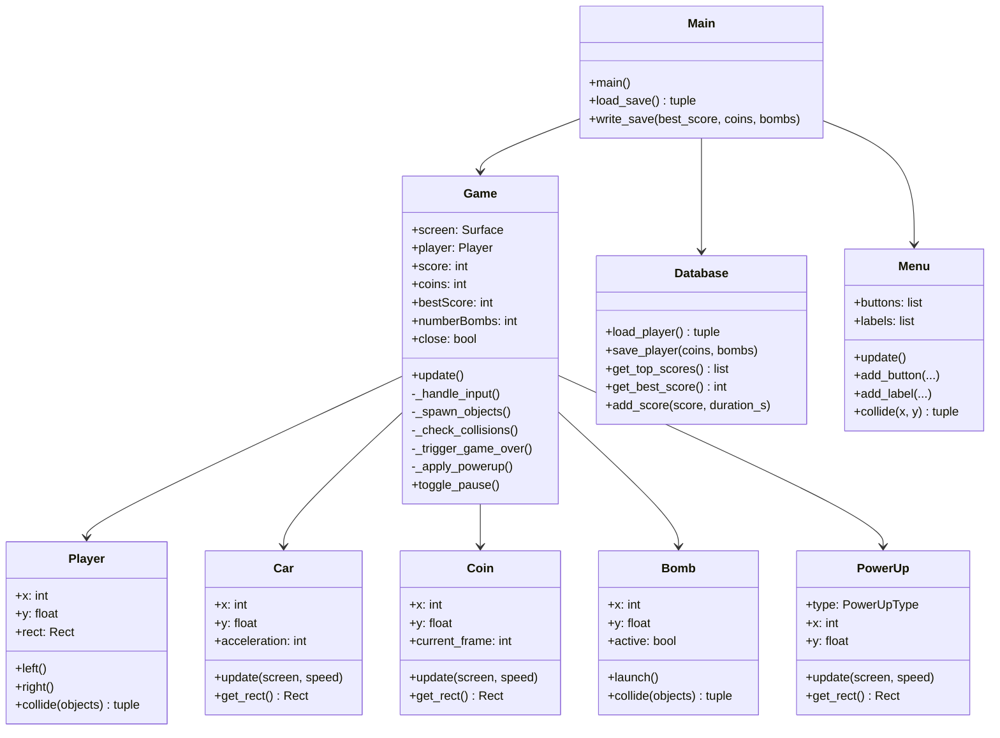

<div align="center">

# 🚗 DASHWAY

**Un jeu d'arcade de conduite à trois voies — inspiré du classique Nokia 3310**


</div>

---

## 📖 À propos

Dashway est un jeu de course arcade en vue de dessus développé avec **Python** et **Pygame**.
Évitez les voitures adverses sur trois voies, collectez des pièces, achetez des bombes et grimpez
au classement — le tout dans une esthétique pixel-art hommage à l'emblématique jeu de voiture Nokia.

Créé à l'origine en projet de groupe lors d'un **marathon de développement de 24 heures** en Bachelor 1
(OpenIT, 2023). Cette version est un refactor complet avec une architecture propre, des docstrings
en anglais, une API de leaderboard en ligne et un pipeline CI/CD automatisé.

---

## 🎮 Gameplay

| Action | Touche |
|---|---|
| Se déplacer à gauche | ← Flèche |
| Se déplacer à droite | → Flèche |
| Lancer une bombe | Espace |
| Pause | Échap |

**Score** — chaque voiture ennemie qui sort par le bas sans vous toucher rapporte **1 point**.
La vitesse augmente avec le score selon la formule `vitesse = BASE + floor(score / (n²·1.5))`.

**Pièces** — collectées en jeu, dépensées dans le **Shop** pour acheter des bombes (3 pièces chacune).

**Bombes** — lancées vers le haut pour détruire la première voiture ennemie touchée.

### Power-ups

| Icône | Type | Effet |
|---|---|---|
| 🛡 `[S]` | **Bouclier** | Absorbe une collision (activation manuelle avec **P**) |
| 💠 `[SL]` | **Ralenti** | Divise la vitesse par deux pendant 4 secondes |
| ⭐ `[x2]` | **Multiplicateur** | Double les pièces gagnées pendant 5 secondes |

---

## 🗂 Structure du projet
---

## 🏗 Architecture



---

## 🔐 Architecture de l'API**Sécurité implémentée :**
- Mots de passe hashés avec **bcrypt**
- Authentification par **JWT** (expiration 24h)
- Intégrité des scores vérifiée par **HMAC-SHA256** (anti-triche basique)
- **Rate limiting** : 10 soumissions de score par minute par IP

---

## 🚀 Installation et lancement

### Prérequis

- Python **3.10+**
- pip

### Installation

```bash
# 1. Cloner le dépôt
git clone https://github.com/joresseeff/dashway.git
cd dashway

# 2. Créer un environnement virtuel (recommandé)
python -m venv venv
source venv/bin/activate        # Windows : venv\Scripts\activate

# 3. Installer les dépendances
pip install pygame

# 4. Lancer le jeu
cd scr
python main.py
```

### Avec Docker (jeu + API)

```bash
# Lancer le jeu et l'API ensemble
docker compose up --build

# L'API est accessible sur http://localhost:8000
# Documentation interactive : http://localhost:8000/docs
```

### Build exécutable Windows

```bash
pip install pyinstaller
cd scr
pyinstaller --onefile --noconsole --name Dashway \
            --add-data "../assets;assets" \
            --add-data "../sounds;sounds" \
            --add-data "../munro.ttf;." main.py
# Exécutable → dist/Dashway.exe
```

---

## ⚙️ Configuration

Constantes globales dans `scr/init.py` :

| Constante | Valeur par défaut | Description |
|---|---|---|
| `WIDTH` | `500` | Largeur de la fenêtre (pixels) |
| `HEIGHT` | `800` | Hauteur de la fenêtre (pixels) |
| `OFFSET` | `WIDTH / 10` | Marge pour centrer les sprites dans une voie |

Constantes d'équilibrage dans `scr/game.py` :

| Constante | Valeur | Description |
|---|---|---|
| `_BASE_SPEED` | `9` | Vitesse de défilement initiale |
| `_COUNTDOWN` | `3` | Compte à rebours avant le début (secondes) |
| `_OBJ_COOLDOWN` | `0.8` | Délai entre deux spawns (secondes) |
| `_GAMEOVER_DELAY` | `1.5` | Durée d'affichage de l'explosion (secondes) |
| `_SLOW_DURATION` | `4.0` | Durée du ralenti (secondes) |
| `_MULTI_DURATION` | `5.0` | Durée du multiplicateur (secondes) |

---

## 🧪 Tests

```bash
# Tests du jeu (sans serveur)
pip install pygame pytest
SDL_VIDEODRIVER=dummy SDL_AUDIODRIVER=dummy pytest tests/ -v --tb=short

# Tests de l'API
pip install -r api/requirements.txt httpx
pytest tests/test_api.py -v
```

**Couverture actuelle : 34 tests**

| Fichier | Tests | Couverture |
|---|---|---|
| `test_button.py` | 7 | Collisions boutons |
| `test_player.py` | 6 | Déplacements et limites de voie |
| `test_database.py` | 8 | CRUD SQLite, leaderboard |
| `test_powerup.py` | 3 | Instanciation, hitbox, chute |
| `test_api.py` | 10 | Auth JWT, soumission scores, HMAC |

---

## 🛣 Feuille de route

- [x] Phase 1 — Qualité du code, documentation, CI/CD
- [x] Phase 2 — Améliorations gameplay (power-ups, pause, leaderboard SQLite)
- [x] Phase 3 — Infrastructure (Docker multi-stage, GHCR, release automatique)
- [x] Phase 4 — API en ligne (FastAPI, JWT, HMAC anti-cheat)
- [ ] Phase 5 — Port web/mobile (Phaser.js ou Kivy)

---

## 🤝 Contribuer

Les pull requests sont les bienvenues. Pour les changements majeurs, ouvrez d'abord une issue.

1. Forkez le dépôt
2. Créez une branche (`git checkout -b feat/ma-fonctionnalite`)
3. Commitez vos changements (`git commit -m "feat: ajouter le bouclier power-up"`)
4. Pushez la branche (`git push origin feat/ma-fonctionnalite`)
5. Ouvrez une Pull Request

Suivez les [Conventional Commits](https://www.conventionalcommits.org/fr/) pour les messages de commit.

---

## 📜 Licence

Distribué sous la **Licence MIT** — voir [LICENSE](LICENSE) pour les détails.

---

## 🙏 Remerciements

- Membres de l'équipe originale du marathon dev OpenIT (2023)
- Le jeu de voiture Nokia 3310 — l'inspiration intemporelle
- [Police Munro](https://www.dafont.com/munro.font) par Ten by Twenty
