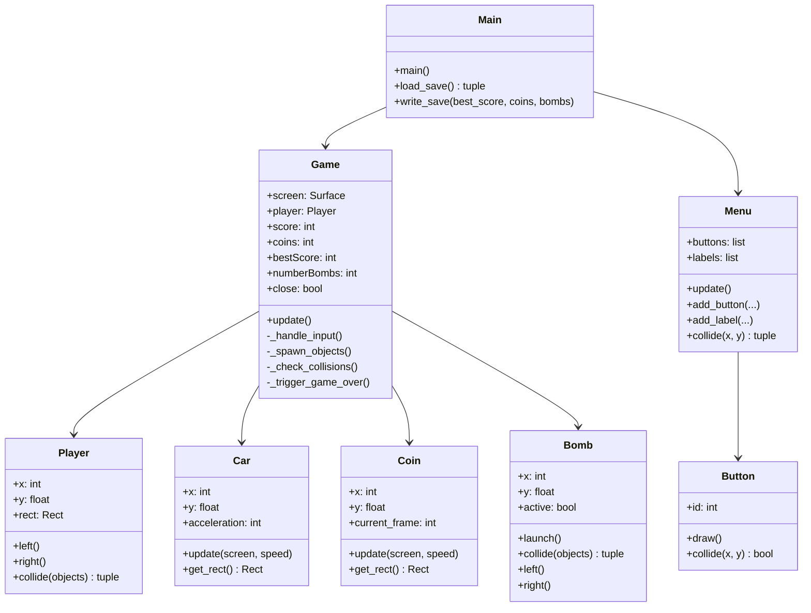

<div align="center">

# 🚗 DASHWAY

**A three-lane arcade car dodger — inspired by the Nokia 3310 classic**


</div>

---

## 📖 About

Dashway is a top-down arcade racing game built with **Python** and **Pygame**.
Dodge incoming cars across three lanes, collect coins, buy bombs, and climb the
scoreboard — all in a pixel-art aesthetic paying homage to the iconic Nokia car game.

Originally created as a group project during a **24-hour dev marathon** in Bachelor 1
(OpenIT, 2023). This version is a full refactor with clean architecture, English
docstrings, and an automated CI/CD pipeline.

---

## 🎮 Gameplay

| Action | Key |
|---|---|
| Move left | ← Arrow |
| Move right | → Arrow |
| Launch bomb | Space |

**Scoring** — every enemy car that exits the bottom of the screen without hitting
you earns **1 point**. Speed increases with your score following the formula
`speed = BASE + floor(score / (n²·1.5))`.

**Coins** — collected in-game, spent in the **Shop** to buy bombs (3 coins each).

**Bombs** — launched upward to destroy the first enemy car they hit.

---

## 🗂 Project Structure

```
dashway/
├── scr/                 # All Python source files
│   ├── main.py          # Entry point — window, sounds, main loop
│   ├── game.py          # Game session logic (spawning, collisions, HUD)
│   ├── player.py        # Player-controlled car
│   ├── car.py           # Enemy car sprite
│   ├── coin.py          # Collectable coin with spin animation
│   ├── bomb.py          # Player projectile
│   ├── menu.py          # Generic menu screen
│   ├── button.py        # Clickable UI button
│   └── init.py          # Global constants (WIDTH, HEIGHT, etc.)
├── assets/              # PNG sprites and backgrounds
├── sounds/              # MP3 sound effects and music
├── munro.ttf            # Pixel font
├── save.txt             # Persisted player data (gitignored)
├── .gitignore
├── LICENSE              # MIT
└── README.md
```

---

## 🏗 Architecture



---

## 🚀 Getting Started

### Prerequisites

- Python **3.10+**
- pip

### Installation

```bash
# 1. Clone the repo
git clone https://github.com/YOUR_USERNAME/dashway.git
cd dashway

# 2. Create a virtual environment (recommended)
python -m venv venv
source venv/bin/activate        # Windows: venv\Scripts\activate

# 3. Install dependencies
pip install pygame

# 4. Run the game
cd scr
python main.py
```

### Build a standalone executable (Windows)

```bash
pip install pyinstaller
cd scr
pyinstaller --onefile --noconsole --add-data "../assets;assets" \
            --add-data "../sounds;sounds" \
            --add-data "../munro.ttf;." main.py
# Executable → dist/main.exe
```

---

## 🔧 Configuration

All tunable constants live in `scr/init.py`:

| Constant | Default | Description |
|---|---|---|
| `WIDTH` | `500` | Window width in pixels |
| `HEIGHT` | `800` | Window height in pixels |
| `OFFSET` | `WIDTH / 10` | Lane-padding for sprite centring |

Game-balance constants are class-level attributes in `game.py`:

| Constant | Default | Description |
|---|---|---|
| `_BASE_SPEED` | `9` | Starting scroll speed |
| `_COUNTDOWN` | `3` | Pre-game countdown (seconds) |
| `_OBJ_COOLDOWN` | `0.8` | Seconds between spawns |
| `_GAMEOVER_DELAY` | `1.5` | Boom screen duration (seconds) |

---

## 🛣 Roadmap

- [x] Phase 1 — Code quality, documentation, CI/CD
- [ ] Phase 2 — Gameplay improvements (power-ups, pause, top-5 scores, SQLite save)
- [ ] Phase 3 — Infrastructure (Docker, GitHub Actions releases)
- [ ] Phase 4 — Online leaderboard (FastAPI + JWT + anti-cheat HMAC)
- [ ] Phase 5 — Web/mobile port (Phaser.js or Kivy)

---

## 🤝 Contributing

Pull requests are welcome. For major changes, please open an issue first to
discuss what you would like to change.

1. Fork the repository
2. Create a feature branch (`git checkout -b feat/my-feature`)
3. Commit your changes (`git commit -m "feat: add shield power-up"`)
4. Push to the branch (`git push origin feat/my-feature`)
5. Open a Pull Request

Please follow [Conventional Commits](https://www.conventionalcommits.org/) for
commit messages.

---

## 📜 License

Distributed under the **MIT License** — see [LICENSE](LICENSE) for details.

---

## 🙏 Acknowledgements

- Original team members from the OpenIT dev marathon (2023)
- Nokia 3310 car game — the timeless inspiration
- [Munro font](https://www.dafont.com/munro.font) by Ten by Twenty
